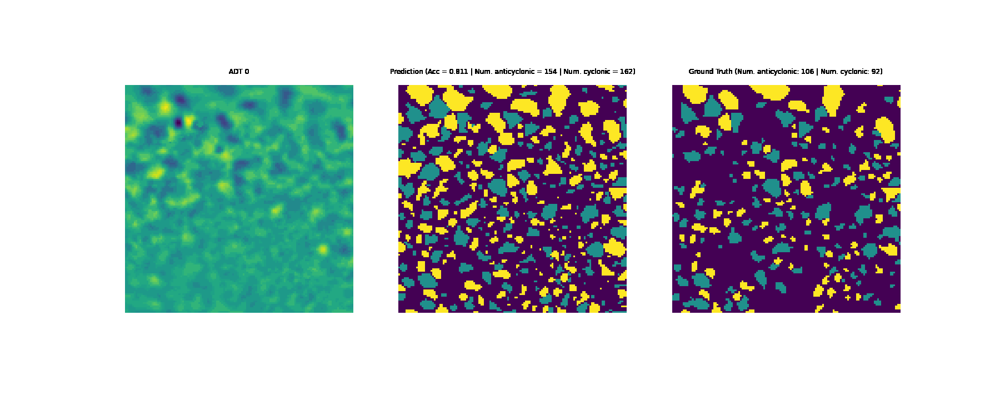

This repository contains the content and source code for the machine learning on ocean eddies chapter of the Earth AI book.

Authors: 

-  Edwin Goh @edwinytgoh (Machine learning)
-  Jinbo Wang @jinbow (Science advisor)
-  Annie K. Didier @adidier17 (Data scientist)

This chapter is composed of two main notebooks, located in the `src/notebooks` folder. These notebooks are:

- `1. Introduction.ipynb` <a href="https://colab.research.google.com/github/podaac/machine-learning/blob/main/eddy-detection/v1.book_chapter/src/notebooks/1. Introduction.ipynb"></a> 
- `2. Train Eddy Segmentation.ipynb` <a href="https://colab.research.google.com/github/podaac/machine-learning/blob/main/eddy-detection/v1.book_chapter/src/notebooks/2. Train Eddy Segmentation.ipynb"></a> 
<!--> https://github.com/podaac/machine-learning/tree/main/eddy-detection/v1.book_chapter <-->




# Installation Instructions:
## Download Conda (if necessary)
We use conda to create and manage different Python environments. You can download the conda installer for your operating system [here](https://docs.conda.io/projects/conda/en/latest/user-guide/install/download.html).


## Create Conda virtual environment
To create a conda environment, you will need to open your system's terminal (e.g., cmd.exe in windows or bash in Linux) and type one of the following commands depending whether you are using a GPU. 

### If your CUDA driver is 11.0 or later:
```
conda create --name eddy_env python=3.8 pytorch torchvision torchaudio cudatoolkit=11.3 matplotlib cudnn tensorboard torchmetrics seaborn opencv tqdm pandas -c anaconda -c pytorch -c conda-forge
```

### If your CUDA driver is 10.2:
```
conda create --name eddy_env python=3.8 pytorch torchvision torchaudio cudatoolkit=10.2 matplotlib cudnn tensorboard torchmetrics seaborn opencv tqdm pandas -c anaconda -c pytorch -c conda-forge
```

### If you don't have a GPU:
```
conda create --name eddy_env python=3.8 pytorch torchvision torchaudio cpuonly matplotlib tensorboard torchmetrics seaborn opencv tqdm pandas -c anaconda -c pytorch -c conda-forge
```

# Running the notebooks
Once you have created the `eddy_env` environment, you can run the notebooks by changing directories to the chapter repo `cd /path/to/chapter/repo` and executing the following commands:

```
conda activate eddy_env
jupyter notebook
```

This will run a Jupyter notebook _server_ in your current directory on your terminal, and a browser window will pop up with the Jupyter notebook frontend UI. You can then find open the notebooks from this UI.
